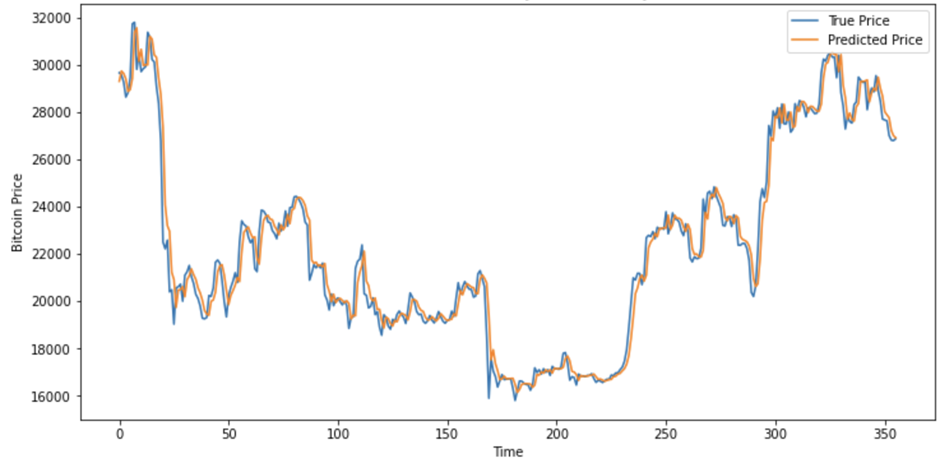
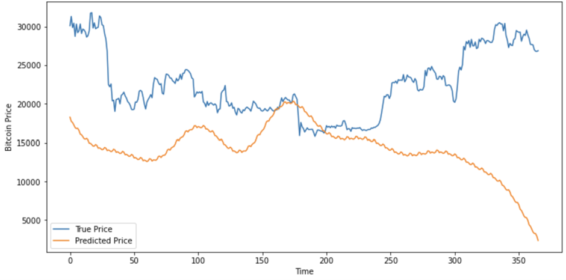

# Bitcoinprediction
<B>An implementation of bitcoin price prediction using LSTM, RNN, and Neural Prophet.</b>
  
• 5 years of Bitcoin price dataset collect from Yahoo Finance  
• Long Short-Term Memory (LSTM) / Recurrent Neural Network (RNN)  
• Neural Prophet  

# Data
• Collect from Yahoo Finance (https://finance.yahoo.com/)  
• Range from the 15th of May 2018 until 14th of May 2023 (5 Years)  
• 1827 rows of data  
• Close price as a Target Variable
• 80%(4 years) for training, 20% for testing (1 year)

# Requirement
•	Python 3.10  
•	Jupyter notebook 6.4.5

# Libraries and modules
• Pandas  
• Numpy  
• matplotlib  
• Scikit-learn  
• TensorFlow  
• NeuralProphet  
• Sklearn.metrics <be>

# Result
<b>LSTM Result</b>  
   

<b>RNN Result</b>  
   

<b>Neural Prophet Result</b>  
  
